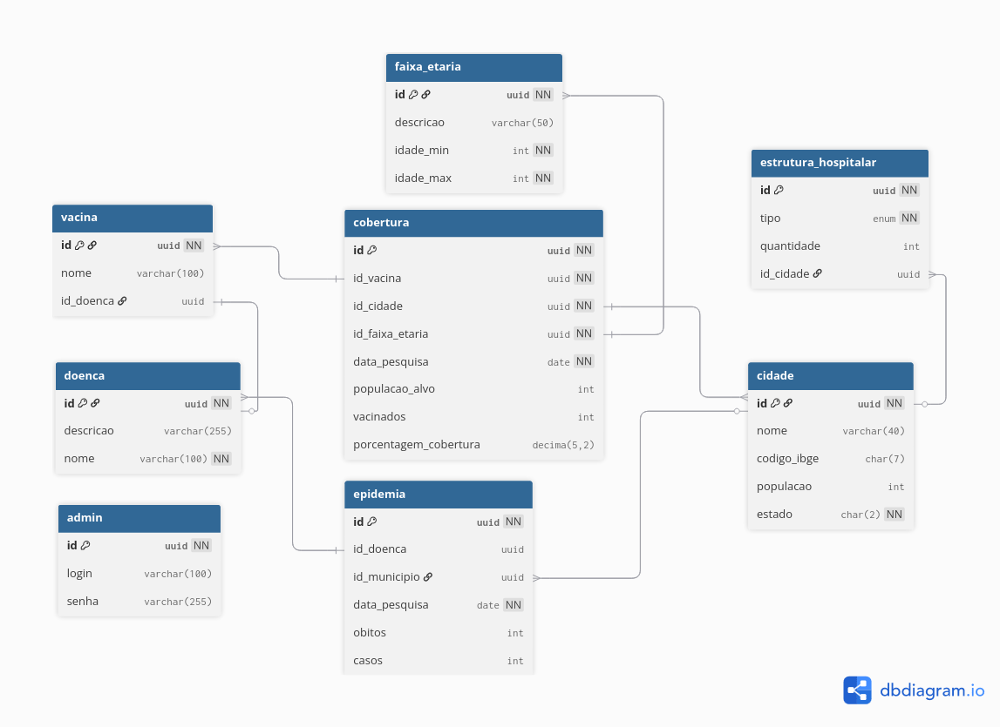

# API_SUS_BR
Desenvolvimento de uma API Pública para o Acesso e Análise de Dados da Saúde Pública no Brasil

## sumário
[descrição](#descrição)
  [resumo](#resumo)
  [funcionalidades](#funcionalidades)
  [regras de negócio](#regras)
  [modelo ER](#modeloER)
[requisitos e deploy](#requisitos_e_deploy)
  [requisitos_de_software](#requisitos-de-software)
  [requisitos_de_hardware](#requisitos-de-hardware)
  [como executar o projeto no vscode](#como-executar-o-projeto-no-vscode)

## descrição

### resumo
  O projeto consiste no desenvolvimento de uma **API RESTful** pública, com o objetivo de servir dados do **Ministério da Saúde** de forma simplificada. Futuramente, uma plataforma web de análise atuará como a camada de visualização, demonstrando o potencial da API. O principal objetivo é **democratizar** o acesso a informações complexas do **Sistema Único de Saúde (SUS)**, que atualmente estão dispersas e em formatos de difícil manipulação para pesquisadores, profissionais de saúde e a sociedade em geral.
A API será o núcleo da solução, permitindo que os usuários extraiam dados valiosos através de endpoints intuitivos.

### funcionalidades
  - **Consulta Epidemiológica por Região:** A API permitirá a consulta de casos e óbitos de doenças específicas por estado, município ou região do país.
  - **Visualização e Análise de Cobertura Vacinal:** Serão disponibilizados dados de cobertura de vacinas por faixa etária e região
  - **Análise de Infraestrutura de Saúde:** O projeto fornecerá dados detalhados sobre a infraestrutura hospitalar, permitindo a consulta do número de leitos de UTI, leitos de internação e a quantidade de hospitais públicos e privados em uma determinada cidade ou estado.

### regras
  - **Autenticação Pública por Chave de API:** Para acessar os endpoints, os usuários públicos deverão enviar uma chave de API válida no cabeçalho de cada requisição.
  - **Paginação de Dados:** Para consultas que retornam grandes volumes de dados a API páginara os resultados, 50 mais ou menos
  - **Autenticação e Autorização Administrativa:** Embora a API seja pública para consumo de dados, existirá um usuário administrador com credenciais autenticadas. Esse usuário será responsável pela manutenção, inserção, atualização e remoção de dados através de endpoints restritos.

### modeloER
  
  
## requisitos e deploy

### requisitos de software

### requisitos de hardware

### como executar o projeto no vscode

### como executar o projeto com docker

### como testar a API
